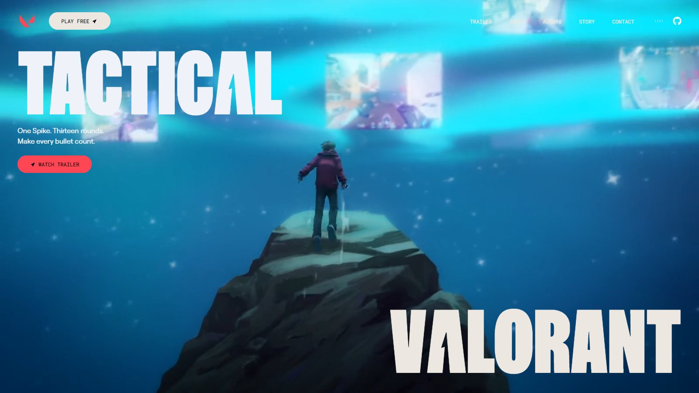
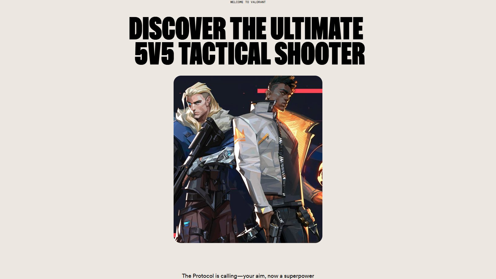
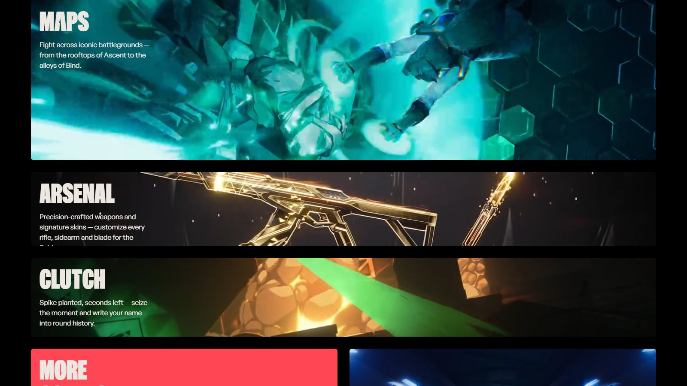
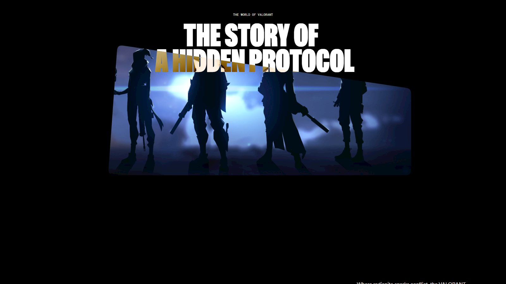
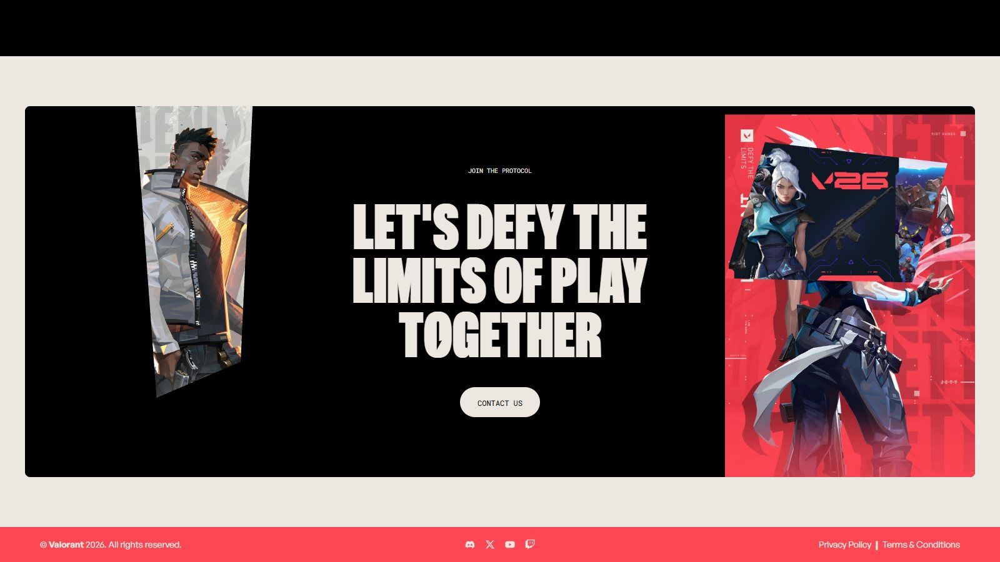

<div align="center">

# VALORANT — 3D Animated Gaming Website

A scroll-driven, cinematic landing page for a VALORANT-style tactical shooter.
Built with React 19, GSAP ScrollTrigger and Tailwind CSS v4, and shipped with
real, self-hosted VALORANT media instead of placeholder art.

[](https://react.dev)
[](https://www.typescriptlang.org)
[](https://vite.dev)
[](https://tailwindcss.com)
[](https://gsap.com)
[](LICENSE)

[Live demo](#-running-locally) · [Media provenance](MEDIA-PROVENANCE.md) · [Report a bug](https://github.com/tricuongdao/game-website/issues)

</div>



## ✨ What's in it

| Section                 | What it does                                                                                                                                                         |
| ----------------------- | -------------------------------------------------------------------------------------------------------------------------------------------------------------------- |
| **Hero**                | Full-bleed video frame with an animated `clip-path` that unfurls on scroll. A mini "up next" reel expands into the full background when clicked, cycling four reels. |
| **About**               | A masked portrait window that grows to fill the viewport, pinned with ScrollTrigger.                                                                                 |
| **Agents / Bento grid** | Six tilting cards in a bento layout, each playing its own looping clip. Cards tilt in 3D toward the cursor.                                                          |
| **Story**               | SVG-filtered image frame with a masked polygon edge and a pointer-driven 3D tilt.                                                                                    |
| **Contact**             | Clipped key-art panels framing a call to action, over the Valorant-red footer.                                                                                       |
| **Navbar**              | Auto-hiding floating nav on scroll, plus an audio toggle that plays a UI sting.                                                                                      |

## 🎬 About the media

The site originally shipped with Zentry placeholder art and hotlinked its nine
videos to a third-party host. **All of it has been replaced with genuine
VALORANT media**, sourced from Riot Games' own public channels and re-encoded
locally:

- **9 video reels** — Riot ships VP9/AV1 WebM (which Safari cannot autoplay and
  which is 3–18 MB each). Everything is re-encoded to H.264 MP4, muted, `+faststart`,
  capped at 30 fps with a bitrate ceiling.
- **7 stills** — official key art and the V25 campaign art, re-encoded to WebP.
- **Brand logo and icons** — the official VALORANT Brand Kit logomark, not a redraw.
- **Zero third-party hotlinks** — the app serves everything from `public/`.

Full attribution, source links and the exact `ffmpeg` settings are in
[**MEDIA-PROVENANCE.md**](MEDIA-PROVENANCE.md).

> VALORANT is a trademark of Riot Games, Inc. This is a non-commercial UI/UX
> demo. Swap the media for your own before any commercial use.

## 📸 Screenshots

| About                                | Bento grid                              |
| ------------------------------------ | --------------------------------------- |
|  |  |

| Story                                | Contact                                |
| ------------------------------------ | -------------------------------------- |
|  |  |

## 🚀 Running locally

Requires **Node.js 20+**.

```bash
git clone https://github.com/tricuongdao/game-website.git
cd game-website
npm install
npm run dev
```

Then open <http://localhost:5173>.

### Scripts

| Command                | Description                                               |
| ---------------------- | --------------------------------------------------------- |
| `npm run dev`          | Start the Vite dev server                                 |
| `npm run build`        | Type-check and build for production into `dist/`          |
| `npm run preview`      | Serve the production build locally                        |
| `npm run typecheck`    | Run `tsc` without emitting                                |
| `npm run lint`         | ESLint over the project                                   |
| `npm run format`       | Check formatting with Prettier                            |
| `npm run format:fix`   | Apply Prettier formatting                                 |
| `npm run verify:media` | Headless-browser check that every asset loads and is 16:9 |

## 🧪 Verifying the media

`npm run verify:media` drives headless Chrome over the DevTools Protocol against
the running dev server and asserts that:

- every `<video>` has buffered (`readyState >= 2`) and is true 16:9,
- every `` decoded (`naturalWidth > 0`),
- every asset returns `200` on a `HEAD` request,
- the preloader actually cleared.

It exits non-zero on regression, and writes section screenshots to your temp
directory. Use it after changing any media.

```bash
npm run dev            # in one terminal
npm run verify:media   # in another
```

## 🛠 Tech stack

- **React 19** with the React Compiler-ready `@vitejs/plugin-react`
- **TypeScript 7** in strict mode
- **GSAP 3** + `@gsap/react` — `ScrollTrigger` timelines, pinned sections
- **Tailwind CSS v4** — CSS-first theme, custom utilities and `clip-path` masks
- **Vite 8** for dev and build
- **ESLint 10** + **Prettier 3** with the Tailwind class-sorting plugin

## 📁 Project structure

<!--- FOLDER_STRUCTURE_START --->
<!--- FOLDER_STRUCTURE_END --->

## 📦 Dependencies

<!--- DEPENDENCIES_START --->
<!--- DEPENDENCIES_END --->

## ☁️ Deploying

The repository includes a `netlify.toml` that skips builds for docs-only commits.
Any static host works — build with `npm run build` and serve `dist/`:

| Setting           | Value           |
| ----------------- | --------------- |
| Build command     | `npm run build` |
| Publish directory | `dist`          |
| Node version      | 20 or newer     |

## 🙏 Credits

Built on the original
[Zentry-style 3D animated template](https://github.com/sanidhyy/game-website) by
[Sanidhya Kumar Verma](https://github.com/sanidhyy), used under the MIT License
and rethemed for VALORANT.

## 📄 License

[MIT](LICENSE) © Sanidhya Kumar Verma and contributors.
